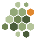

# liken brand

This repository is the brand domain of
[liken](https://github.com/liken-sh/liken): the mark, the shared
stylesheet, and the Hugo theme that every liken site uses. The main
manual at [liken.sh](https://liken.sh) and the operators' sites use
the same shell, the same nav, and the same stylesheet, so the family
reads as one place.

Two kinds of consumer read this repository:

* **Hugo sites** take it as a git submodule at `themes/brand` and set
  `theme: brand`. The theme carries the page shell (`layouts/`), the
  public files every site serves (`static/`), and the nav entries
  (`data/nav.yaml`).
* **Go programs** that build pages outside Hugo import it as the
  module `github.com/liken-sh/brand`. The package embeds the
  stylesheet and the mark, so a page builder such as liken's release
  channel inlines them with no file to copy.

## Using the theme

Add the theme to a site:

```sh
git submodule add https://github.com/liken-sh/brand themes/brand
```

Then declare it in the site's `hugo.yaml`, together with the Markdown
output format:

```yaml
theme: brand

outputFormats:
  markdown:
    mediaType: text/markdown
    baseName: index
    isPlainText: true

outputs:
  home: [html, markdown]
  section: [html, markdown]
  page: [html, markdown]
```

The theme renders every page twice: as HTML for people, and as the
authored Markdown for agents and scripts. The two files land side by
side, so the Markdown twin of `/docs/guides/install/` is
`/docs/guides/install/index.md`, and every HTML page's footer links
to its twin. The `outputFormats` block above is what turns the twin
on; without it, a site builds, but only as HTML.

The theme's `static/` tree merges into the site's output, so every
site serves the same brand URLs: `/favicon.ico` and `/icon.svg` for
browsers, and `/brand/liken.svg` and `/brand/liken.png` as stable
public homes for the mark. The stylesheet never becomes a URL: the
shell inlines it into every page, for the reason the stylesheet
section below gives.

`data/nav.yaml` lists the entries of the top nav, in order, with
absolute URLs. Every site renders the same nav from this file, so a
change to the family's links is one commit here and a submodule bump
in each site.

The layouts a site can override by shipping its own file of the same
name, because Hugo gives a site's `layouts/` precedence over the
theme's. liken.sh does this for its `llms.txt` outputs; a site with
no override gets the theme's shell unchanged.

# The mark

`liken`'s icon is a patch of lichen, drawn as hexagonal tiles.



The pun holds at more than one level.

A lichen is not one organism. It is a fungus and a photosynthetic
partner (an alga or a cyanobacterium) living so closely that the
pair is named and classified as a single thing. That is what `liken`
is: the Linux kernel and `k3s`, each its own upstream project,
assembled so tightly that a machine boots the pair as one system.

Lichens are also pioneers. They are among the first living things to
take hold on bare rock, enduring drought, heat, and bare mineral where
nothing else will grow, and they are what begins to turn rock into
soil. `liken` starts from the same emptiness: a blank machine, bare
metal, nothing installed.

And a lichen is frugal by nature, thriving on almost nothing. `liken`
is built to run a real Kubernetes cluster inside a gigabyte of memory,
on hardware other systems would call too small.

## The tiles

Many crustose lichens grow flat against rock. As they age, and as
repeated wetting and drying shrinks the crust, the surface cracks into
small polygonal plates. Each plate is called an *areole*, and a
thallus built this way is *areolate*. The cracking forms a natural
mosaic of small plates. The icon reproduces that mosaic, one areole to
a tile.

Drawing the areoles as hexagons adds a second reference. The
Kubernetes community commonly uses the hexagon shape, from Helm's logo
to the backdrops of community talks. Because of this, the same
picture reads as lichen on rock to a botanist, and as a
Kubernetes shape to someone from that community.

One tile is orange, not green. Some of the most common rock lichens,
the *Xanthoria*, are a vivid orange. This single warm tile gives the
mark a focal point.

The tiles grow smaller toward one edge of the mark. This detail is an
invention and not biology: real areoles do not reliably shrink toward
the margin, because the cracking tends to start in the older center.
The gradient suggests a colony still spreading into bare rock, though
real lichens do not grow that way.

## The colors

The greens come from crustose lichens on stone, from deep moss to
pale sage. The one orange tile comes from *Xanthoria*.

| Swatch | Hex | Name |
| --- | --- | --- |
| Deep moss | `#4a5d3a` | darkest green |
| Mid sage | `#6e8352` | the body green |
| Light sage | `#93a877` | |
| Pale sage | `#b4c49a` | lightest green |
| Xanthoria | `#e0872f` | the one warm tile |

The mark has no background. It is transparent, so it works on both
light and dark surfaces. Every tile uses a flat color with no
gradients or effects. Because of this, the mark stays legible when
shrunk to a favicon, and it would print cleanly in one ink.

## The stylesheet

`liken.css` is the presentation that every liken site and
releases.liken.sh share: the colors, the type, and the few elements
that prose and reference tables need. It carries both a light and a
dark scheme, chosen by the reader's system setting, and it takes its
accent from the greens above. Anything about the shape of one site,
the manual's sidebar or the channel's digest columns, stays with that
site.

No site links the file over the network. Each one inlines it into
every page. The channel needs this: it lives in object storage, apart
from any cluster, because machines upgrade themselves from it and it
has to answer when the cluster does not. A stylesheet fetched from
liken.sh would put the website back in that path.

The consumers read the file two ways. The Hugo theme inlines the
committed copy in `assets/`, and the release channel's pages read the
original through the `brand` Go package, because a Go program can
only embed files from its own module. The file at the root of this
repository is the only original.

## The files

`liken.svg` is the original file; every other image in this list
comes from it. `make` derives the other files, and the repository
also commits them. Because of this, anyone can get a favicon or an
avatar without installing a rasterizer, and a site that takes the
theme as a submodule serves them with no build step:

* `liken.svg` — the original file, for any use at any size.
* `favicon.ico` — a 16, 32, and 48 pixel raster image, for the browser
  tab. The sites also serve the SVG file itself. Modern browsers
  prefer the SVG file and render it sharp at any size; `favicon.ico`
  is the fallback for browsers that cannot use the SVG file.
* `liken.png` — a 1024-pixel transparent export. Use it for a GitHub
  organization avatar or anywhere else that needs a raster image.
* `static/` and `assets/` — the copies the theme serves, under the
  URLs the pages link to. The Makefile explains each one.

To rebuild these files, you need `rsvg-convert` (from librsvg) and
ImageMagick. Edit `liken.svg`, run `make`, and commit the files that
change.

## Sources

The biology in this document comes from standard lichenology sources:

* Irwin M. Brodo, Sylvia Duran Sharnoff, and Stephen Sharnoff,
  *Lichens of North America* (Yale University Press, 2001) — the
  standard field reference for the symbiosis and for growth forms.
* [British Lichen Society: Lichen
  Morphology](https://britishlichensociety.org.uk/learning/lichen-morphology)
  — areoles and the areolate crustose thallus.
* [Crustose lichen](https://en.wikipedia.org/wiki/Crustose_lichen) and
  [Lichen](https://en.wikipedia.org/wiki/Lichen), Wikipedia — the
  mycobiont/photobiont symbiosis and the pioneer role in primary
  succession, both with citations to the primary literature.
